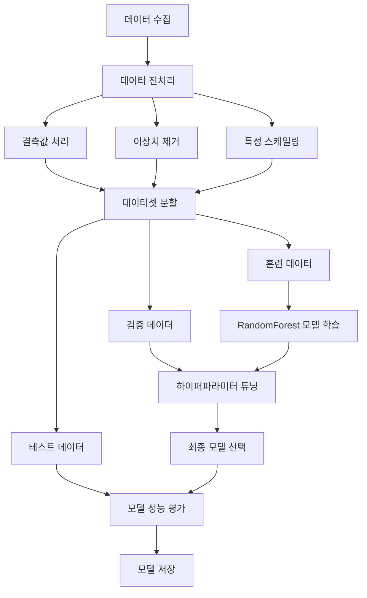
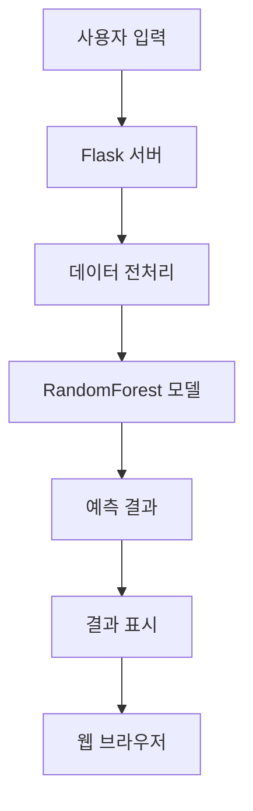

# 🌍 대기질 예측 웹 애플리케이션

## 📌 프로젝트 소개
이 프로젝트는 다양한 대기 오염 물질의 농도를 기반으로 대기질 등급을 예측하는 머신러닝 기반 웹 애플리케이션입니다. RandomForest 분류 모델을 사용하여 높은 정확도의 예측을 제공하며, 사용자 친화적인 웹 인터페이스를 통해 쉽게 결과를 확인할 수 있습니다.

## 🎯 주요 기능
- 5가지 주요 대기 오염 물질 농도 기반 예측
  - 초미세먼지(PM2.5)
  - 오존(O3)
  - 이산화질소(NO2)
  - 일산화탄소(CO)
  - 아황산가스(SO2)
- 실시간 대기질 등급 예측
- 웹 기반 사용자 인터페이스
- 결과의 시각적 표현

## 🤖 모델 개발
### 사용된 알고리즘
- **RandomForestClassifier**
  - 앙상블 학습 방법을 통한 높은 정확도
  - 과적합 방지를 위한 배깅(Bagging) 활용
  - 특성 중요도 분석 가능

### 모델 학습 과정


### 모델 성능
- **Accuracy**: 0.78 (78%)
- **Log Loss**: 0.74
- 교차 검증을 통한 모델 신뢰성 검증

## 🛠 기술 스택
- **Backend**: Python, Flask
- **Machine Learning**: 
  - Scikit-learn (RandomForestClassifier)
  - Pandas (데이터 처리)
  - Joblib (모델 저장/로드)
- **Frontend**: HTML, CSS, JavaScript
- **데이터 처리**: Pandas, NumPy

## 🔍 시스템 아키텍처


## ⚙️ 설치 방법
1. 저장소 클론
```bash
git clone [저장소 URL]
```

2. 가상환경 생성 및 활성화
```bash
python -m venv venv
.\venv\Scripts\activate  # Windows
```

3. 필요한 패키지 설치
```bash
pip install flask pandas scikit-learn joblib
```

4. 모델 파일 준비
- `model.zip` 파일을 다운로드하여 압축 해제
- `model.pkl` 파일을 프로젝트 루트 디렉토리에 위치

5. 애플리케이션 실행
```bash
python app.py
```

6. 웹 브라우저에서 접속
```
http://localhost:5000
```

## 📁 프로젝트 구조
```
air_quality_prediction/
│
├── app.py              # Flask 애플리케이션 메인 파일
├── model.py            # 모델 관련 로직
├── model.pkl           # 학습된 RandomForest 모델 (압축 파일에 포함)
│
├── templates/          # HTML 템플릿
│   ├── index.html     # 메인 페이지
│   └── result.html    # 결과 표시 페이지
│
└── static/            # 정적 파일 (CSS, JS, 이미지)
```

## 💻 사용 방법
1. 웹 인터페이스에 접속
2. 각 대기 오염 물질의 농도 입력
   - PM2.5 (㎍/m3)
   - O3 (ppm)
   - NO2 (ppm)
   - CO (ppm)
   - SO2 (ppm)
3. '예측하기' 버튼 클릭
4. 예측된 대기질 등급 확인

## 🌟 주요 구현 사항
1. **데이터 전처리**
   - 결측값 처리
   - 입력값 검증
   - 데이터 정규화

2. **모델 최적화**
   - RandomForest 하이퍼파라미터 튜닝
   - 교차 검증을 통한 성능 평가
   - 특성 중요도 분석

3. **웹 인터페이스**
   - 사용자 친화적 UI
   - 실시간 입력값 검증
   - 직관적인 결과 표시

## 🔧 개발 환경
- Python 3.8+
- Flask 2.0+
- Scikit-learn 1.0+
- Windows/Linux/MacOS

## 📊 성능 지표
- **정확도(Accuracy)**: 78%
- **로그 손실(Log Loss)**: 0.74
- **특징**:
  - 다중 클래스 분류 문제
  - 불균형 데이터 처리
  - 교차 검증 적용

## 🎉 프로젝트 특징
- 실시간 대기질 예측
- 높은 예측 정확도
- 사용자 친화적 인터페이스
- 확장 가능한 시스템 설계
- 실용적인 환경 모니터링 도구

## ⚠️ 참고사항
- 모델 파일(`model.pkl`)은 용량 문제로 인해 `model.zip`으로 압축되어 제공됩니다.
- 실행 전 반드시 압축을 해제하여 사용해주세요. 